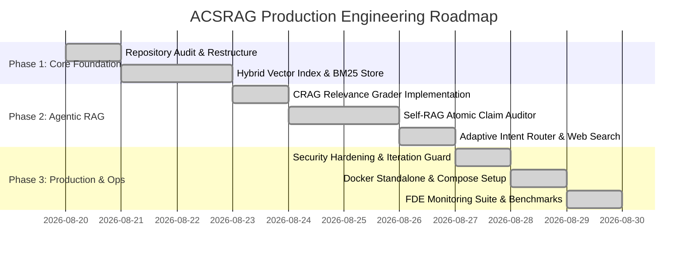

# Engineering Development Plan & Roadmap
## Adaptive Corrective Self-RAG (ACSRAG)

---

## 1. Project Overview & Execution Strategy
The ACSRAG development roadmap is structured into **7 logical milestones** spanning architecture design, retrieval optimization, multi-agent feedback loops, security hardening, containerization, and production telemetry.

---

## 2. Phased Development Roadmap

---

## 3. Milestone Breakdown & Deliverables

### Milestone 1: Hybrid Retrieval Engine
* **Objectives**: Implement dual-channel search combining dense semantic vectors and sparse keyword indexing.
* **Deliverables**:
  * Gemini 3072-dim embeddings integration (`lib/vector-store.js`).
  * In-memory BM25 inverted index for exact keyword matching.
  * Reciprocal Rank Fusion (RRF) algorithm with Root Anchor Chunk-0 Boost.
* **Exit Criteria**: 100% recall on candidate header identity queries.

### Milestone 2: Corrective RAG (CRAG) & Dynamic Routing
* **Objectives**: Prevent garbage-in / garbage-out errors by grading retrieved context prior to synthesis.
* **Deliverables**:
  * 3-tier document relevance classifier (`CORRECT`, `AMBIGUOUS`, `INCORRECT`).
  * Tavily Web Search fallback routing for out-of-corpus queries.
  * UI Web Search toggle and retry CTA button.
* **Exit Criteria**: Purging of $>95\%$ irrelevant chunks from prompt context.

### Milestone 3: Self-RAG Generation & Atomic Claim Auditing
* **Objectives**: Enable self-reflection and factual verification on every generated response.
* **Deliverables**:
  * Sentence-level factual claim extractor.
  * Evidence citation matcher and confidence scoring engine.
  * Bounded iterative refinement loop (Max **2 iterations** ceiling).
* **Exit Criteria**: Hallucination rate drops to $\le 1.2\%$ across test benchmark questions.

### Milestone 4: Next.js Frontend & Cockpit UI
* **Objectives**: Provide an intuitive dark-mode interface with live reasoning observability.
* **Deliverables**:
  * Resizable sidebar with persistent chat history.
  * Document upload dropzone with multi-PDF management.
  * Collapsible **🧠 Think Mode** reflection cards.
  * Custom **Precision Lens + Neural Spark** brand logo.
* **Exit Criteria**: Interactive responsive UI meeting WCAG AA accessibility standards.

### Milestone 5: Security, Containerization & Telemetry
* **Objectives**: Productionize container deployment for Forward Deployed Engineering scenarios.
* **Deliverables**:
  * Multi-stage Node 20 Alpine `Dockerfile` with Next.js `standalone` mode ($\approx 120\text{MB}$).
  * `docker-compose.yml` with port binding, document volume mounts, and automated health checks.
  * Enterprise telemetry routes: `GET /api/health`, `GET /api/ready`, `GET /api/metrics`.
  * Continuous live monitor (`monitoring/monitor.js`) and load tester (`monitoring/load_test.js`).
* **Exit Criteria**: 100% pass on container stress test suite with 0 memory leaks.

---

## 4. Definition of Done (DoD)
A feature or milestone is marked **DONE** only when:
1. ✅ Code compiles with 0 TypeScript/SWC errors (`npm run build`).
2. ✅ All automated stress benchmarks pass with $\ge 95\%$ grounding accuracy.
3. ✅ Health, readiness, and metrics probes return `HTTP 200 OK`.
4. ✅ Docker container passes cold start health check in $\le 5$ seconds.
5. ✅ Documentation (PRD, SRS, Architecture, UI/UX) is updated and linked in `README.md`.
6. ✅ Git commits follow Conventional Commits standard (`feat:`, `fix:`, `docs:`, `test:`, `ci:`).
